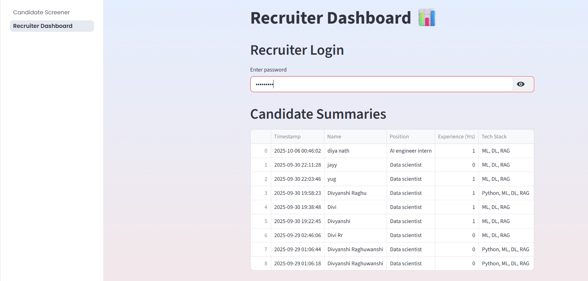
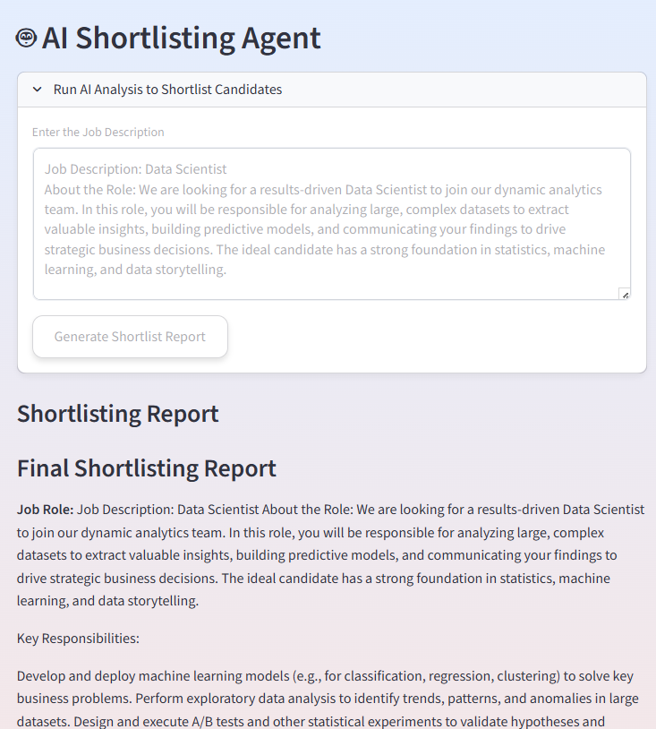
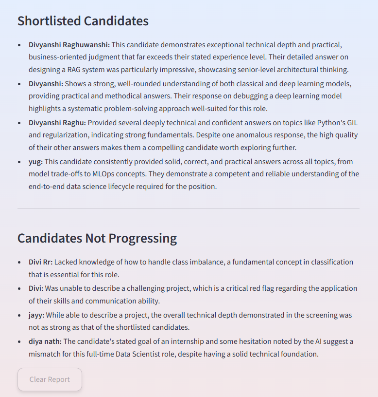

# TalentScout AI: Autonomous Hiring Assistant

## 1. Project Overview

TalentScout is an advanced, multi-agent AI system designed to automate the entire initial hiring workflow, from technical screening to final shortlisting. Built with Python, LangGraph, and Streamlit, it provides a seamless experience for candidates and delivers powerful, AI-driven insights to recruiters.

The application functions as a two-part system:
- **Conversational Screening Agent:** A candidate-facing interface that gathers information and conducts a dynamic, AI-driven technical interview.
- **Recruiter Dashboard & Shortlisting Agent:** A secure dashboard where recruiters can not only review individual candidate reports but also trigger a powerful "AI Hiring Manager" agent. This agent analyzes all candidates against a job description and autonomously generates a final shortlist with detailed justifications.

## 2. Installation Instructions

To set up and run this project locally, please follow these steps:

1.  **Clone the Repository:**
    ```bash
    git clone https://github.com/DivyanshiRaghuwanshi/TalentScout-AI-Recruitment-Assistant.git
    cd TalentScout-AI-Recruitment-Assistant
    ```

2.  **Create and Activate a Virtual Environment:**
    Using a virtual environment is crucial to prevent dependency conflicts.
    ```bash
    # Create the environment
    python -m venv .venv

    # Activate on Windows (PowerShell)
    .\\.venv\\Scripts\\Activate.ps1
    ```

3.  **Install Dependencies:**
    With your virtual environment active, install all required packages from the `requirements.txt` file.
    ```bash
    pip install -r requirements.txt
    ```

4.  **Set Up Environment Variables:**
    Create a file named `.env` in the project's root directory. Add your Google API key to this file:
    ```
    GOOGLE_API_KEY="YOUR_GOOGLE_API_KEY_HERE"
    ```

5.  **Run the Application:**
    Launch the Streamlit app from your terminal.
    ```bash
    streamlit run 1_Candidate_Screener.py
    ```
    The application will open in your default web browser.

## 3. Usage Guide

- **For Candidates:** Access the main URL to begin the screening. Fill out the initial form and upload an optional resume. Answer the technical questions presented by the AI assistant, "Scout."
- **For Recruiters:** Navigate to the "Recruiter Dashboard" and log in. Here you can:
    1.  Review individual candidate summaries and performance metrics.
    2.  Use the **AI Shortlisting Agent** by providing a job description to automatically analyze all candidates and generate a final, ranked shortlist.

## 4. Technical Details

#### Libraries and Tech Stack
- **Backend:** Python
- **AI Agent Framework:** LangGraph, LangChain
- **LLM:** Google Gemini (`gemini-pro-latest`)
- **Frontend:** Streamlit
- **Resume & Vectorization:** FAISS (for in-memory vector search), PyMuPDF (for PDF text extraction)
- **Data Validation:** Pydantic
- **Authentication:** `bcrypt` for secure password hashing.
- **Environment Management:** `python-dotenv` for secrets management.

#### Architectural Decisions
- **Multi-Agent System:** The application is architected as a multi-agent system.
    - The **Screening Agent**, built with a LangGraph state machine, manages the complex, real-time conversational flow of the interview.
    - The **Shortlisting Agent** acts as an autonomous "AI Hiring Manager," processing batch data to perform comparative analysis and decision-making.
- **Separation of Concerns:** Each agent (`interview_graph.py`, `shortlisting_agent.py`) has a distinct responsibility, creating a modular and scalable architecture. The Streamlit UI remains a clean presentation layer.
- **Security:** The recruiter dashboard is protected by a password system using `bcrypt` to store a secure hash of the password, ensuring credentials are not exposed.

## 5. Prompt Design

The effectiveness of the AI hinges on carefully crafted prompts, managed via LangChain's `ChatPromptTemplate`.

- **Persona-Driven Prompts:** The AI is given the persona of "Scout," a sharp, experienced senior engineer, ensuring a professional and appropriate tone.
- **Context-Aware Question Generation:**
    - **With Resume:** If a resume is provided, the prompt instructs the AI to synthesize the candidate's declared tech stack with specific projects mentioned in the resume, leading to deeply personalized questions.
    - **Without Resume:** A fallback prompt generates strong, open-ended questions based solely on the declared tech stack.
- **Structured JSON Output:** For complex tasks like answer analysis, the prompt explicitly instructs the model to return a JSON object, ensuring reliable data parsing.
- **Persona-Driven Shortlisting:** The shortlisting agent is given the persona of an expert Senior Hiring Manager with specific criteria, enabling it to produce high-quality, justified shortlisting reports.

## 6. Challenges & Solutions

- **Challenge:** Managing the complex, multi-step conversational flow of the interview using traditional `if/elif` statements in Streamlit's session state. This approach was becoming difficult to maintain and debug.
- **Solution:** The entire conversational logic was refactored into a state machine using **LangGraph**. This provided a clear, graph-based representation of the interview flow, making the logic more robust, modular, and significantly easier to understand and extend.

- **Challenge:** Encountering API Rate Limit Errors (`429 Quota Exceeded`) during intensive testing.
- **Solution:** The root cause was multiple, rapid-fire API calls. The initial idea of adding `time.sleep()` delays was discarded as it would create a poor user experience. The superior solution involved a significant refactor:
    - **Prompt Engineering:** The AI prompt was re-engineered to request a structured JSON output containing both the sentiment analysis and the next follow-up question in a single response.
    - **Code Refactoring:** The logic was updated to make a single API call and parse the resulting JSON. This dramatically reduced the number of API requests, resolving the rate limit issue while improving application performance.

- **Challenge:** Scaling from a single-purpose screening tool to a comprehensive analysis tool.
- **Solution:** A new, specialized **Shortlisting Agent** was created. This agent is designed for batch processing and comparative analysis, allowing it to evaluate multiple candidates simultaneously against a job description, a task the real-time conversational agent is not suited for.

- **Challenge:** Ensuring the Recruiter Dashboard was secure and not publicly accessible.
- **Solution:** A robust authentication system was built using the `bcrypt` library. A dedicated `auth.py` module handles password hashing, setting, and checking.

## Limitations

-   **In-Memory State:** The application relies on Streamlit's session state, which is not persistent. If the server restarts or the user's session times out, the interview progress will be lost.
-   **No Database:** Candidate summaries are saved as individual JSON files in the `summaries/` directory. This is not a scalable solution for a production environment, which would require a proper database.
-   **Basic Authentication:** The recruiter dashboard uses a single, shared password. It lacks a proper multi-user authentication and authorization system.
-   **LLM Dependency:** The quality of the questions, follow-ups, and summaries is entirely dependent on the performance and availability of a third-party LLM API.

## Future Enhancements

This project provides a strong foundation that can be extended with several powerful features:

-   **Advanced Data Management:** Transitioning from file-based storage to a scalable database (e.g., PostgreSQL) to enable robust querying and long-term data analysis.
-   **Enterprise-Ready Features:** Implementing multi-user authentication for recruiter teams and persistent sessions that allow candidates to pause and resume interviews.
-   **Cloud-Native Deployment:** Containerizing the application with Docker to streamline deployment and ensure consistent, scalable performance in a cloud environment.

## 7. Bonus Enhancements

- **Modern UI/UX:** A custom `style.css` file provides a more attractive and professional user interface with custom fonts, gradients, and interactive hover effects.
- **Sentiment Analysis:** The AI analyzes the text of a candidate's answers to gauge their confidence level, providing recruiters with deeper insight.

## 8. Demo / Screenshots

Here is a walkthrough of the TalentScout AI application, from the candidate's initial interaction to the recruiter's final review.

**1. Candidate Form & Resume Upload**
*The candidate fills in their details and can optionally upload a resume for a more tailored interview.*


**2. AI-Generated Technical Question**
*Based on the tech stack and resume, the AI ("Scout") asks an insightful technical question.*


**3. Dynamic Follow-up Question**
*The AI analyzes the candidate's answer and asks a relevant follow-up question to probe deeper.*


**4. Interview Conclusion & Summary**
*Once the interview is complete, the candidate sees a concluding message and a summary of their performance.*


**5. Secure Recruiter Login**
*Recruiters access a separate, password-protected area.*


**6. Recruiter Dashboard & Candidate Review**
*The dashboard displays all submissions. Recruiters can select a candidate to view their detailed answers and the AI's final assessment.*


**7. AI Shortlisting Agent in Action**
*Recruiters can provide a job description to the new AI agent to get an automated analysis of all candidates.*


**8. Final Shortlist Report**
*The agent delivers a concise, professional report with a ranked list of candidates and justifications for each decision.*

